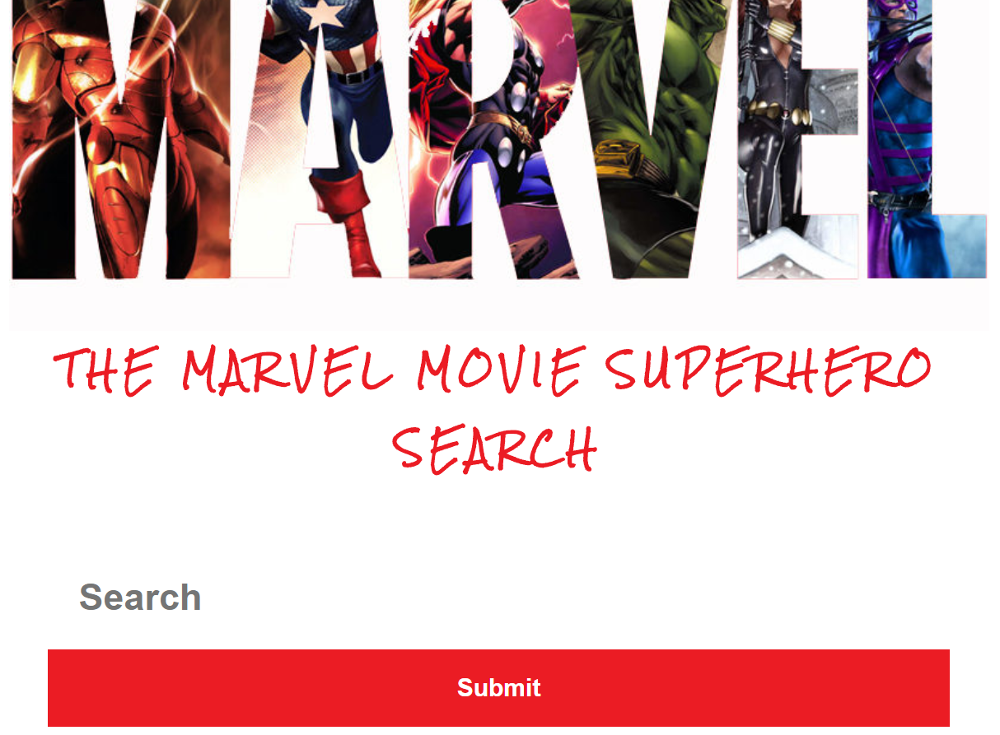
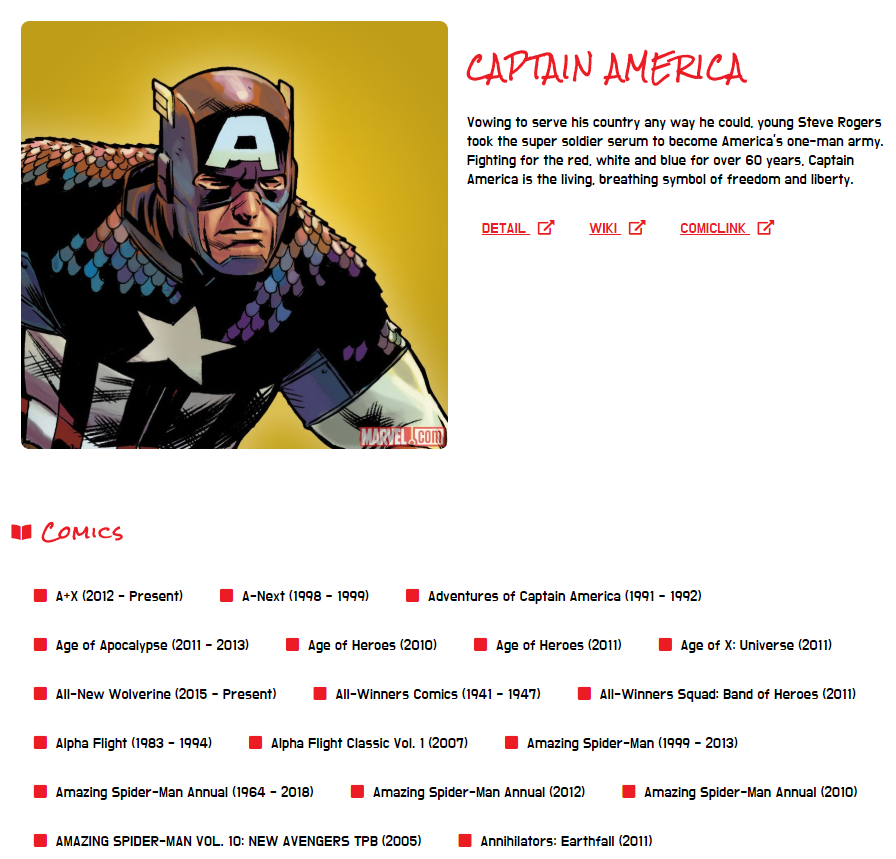
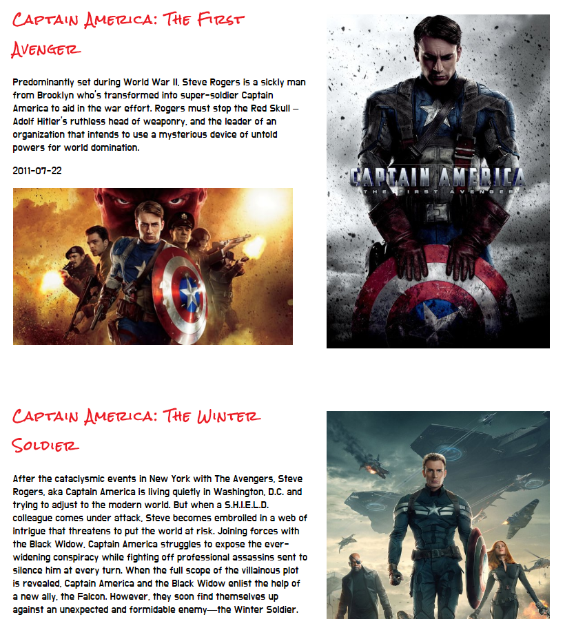
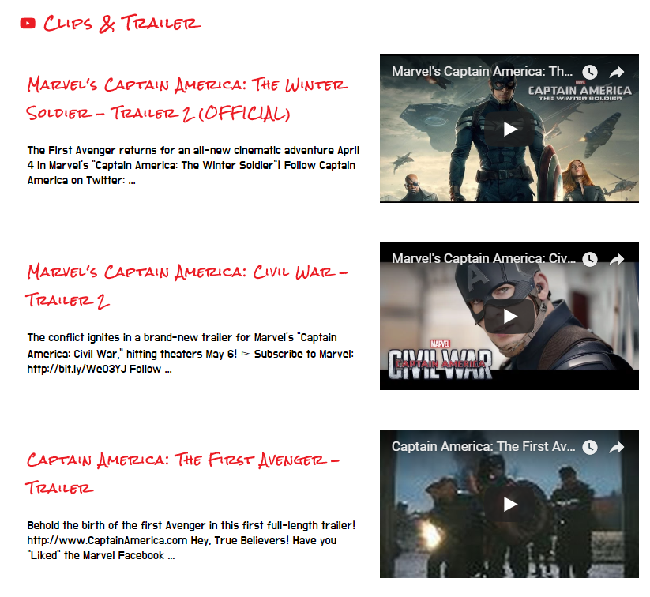

# Marvel Movie Superhero Search 

## Thinkful Bootcamp - Project 2

### Overview:
Create an app that uses / combines APIs to create an interesting site.

### Summary:
Users can get information about their favorite Marvel superhero, including comics and movies that they have appeared in, information about the characters and view trailers and clips from Marvel.

### Technology used:
* HTML
* CSS
* Javascript
* jQuery
* APIs

### Live version:
[Live app- hosted on Siteground](http://www.terrywebdev.services/project_%20interactive_quiz_app/app "Project submission hosted on Siteground")

### Screenshots:

#### Search

#### Comics

#### Movies

#### Clips and Trailers
